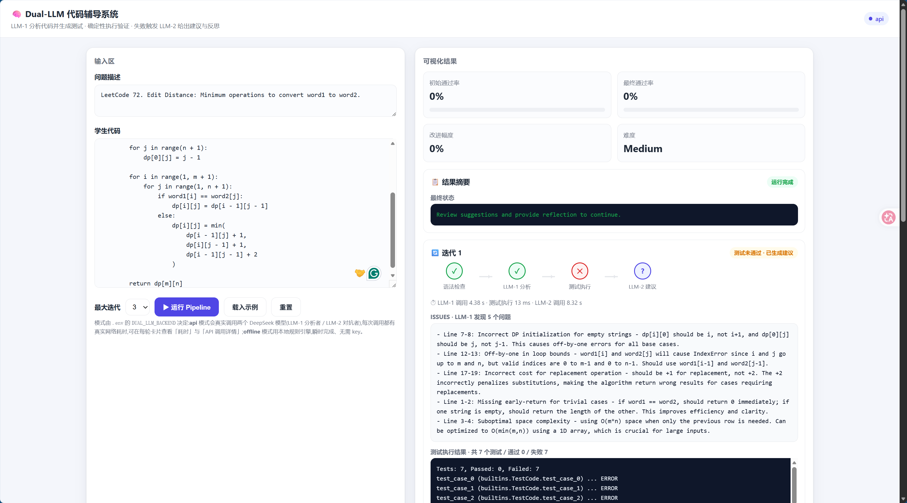

# Dual-LLM Code Tutoring System



A **dual-LLM adversarial code tutoring system**: LLM-1 acts as the "examiner" that analyzes student code and generates test cases, while LLM-2 acts as the "mentor" that produces suggestions and requires student reflection when the code fails the tests. Both LLMs are invoked through the DeepSeek API, forming a genuine adversarial review loop.

---

## Features

- **Dual-LLM adversarial loop**: LLM-1 generates issues and tests; LLM-2 generates suggestions and reflection prompts based on the failures.
- **Pluggable backends**: Supports `api` (real DeepSeek API) and `offline` (local rule engine, no key required).
- **Visual web UI**: Built with Flask + vanilla HTML/CSS/JS. Interactively enter student code, problem description, and student reflection, and watch each iteration's analysis in real time.
- **No API key leakage**: The web UI only shows "LLM1·connected / LLM2·connected". No key fragment is exposed in the call details either.
- **Robust parsing**: Tolerant of Markdown code fences, header variants, and other format drift in real DeepSeek responses.

---

## Project Structure

```text
Dual_LLM/
└── dualllmv2/
    ├── assets/
    │   └── screenshot.png            # Project screenshot
    ├── web/
    │   ├── app.py                    # Flask backend
    │   └── templates/
    │       └── index.html            # Visual frontend
    ├── config.py                     # Config loading, dual-key management, masking
    ├── llm_backends.py               # APIBackend / RuleEngineBackend
    ├── pipeline.py                   # Dual-LLM adversarial pipeline
    ├── parsers.py                    # LLM output parsers
    ├── prompts.py                    # LLM-1 / LLM-2 prompt templates
    ├── utils.py                      # Syntax check, unittest execution
    ├── main.py                       # CLI entry point
    ├── metrics.py                    # Scoring metrics
    ├── llms.py                       # Legacy import compatibility
    ├── requirements.txt              # Dependencies
    ├── .env.example                  # Env template (safe placeholders)
    └── .gitignore                    # Ignores .env and other sensitive files
```

---

## Quick Start

> All commands below are run from inside the `dualllmv2/` folder.

### 1. Requirements

- Python 3.10+
- Anaconda virtual environment recommended (developed using the `DA` environment)

### 2. Install dependencies

```bash
pip install -r requirements.txt
```

Includes Flask, langchain, langchain_openai, langchain_core, python-dotenv, etc.

### 3. Configure environment variables

Copy the template and edit it:

```bash
cp .env.example .env
```

Fill in your DeepSeek API key(s) in `.env`. The two LLMs use independent keys to enable true adversarial calls:

```env
DUAL_LLM_BACKEND=api
LLM1_API_KEY=sk-your-llm1-key-here
LLM2_API_KEY=sk-your-llm2-key-here
LLM1_MODEL=deepseek-chat
LLM2_MODEL=deepseek-chat
```

> ⚠️ **Security note**: `.env` is already ignored by `.gitignore`. **Never** run `git add -f .env`.

### 4. Run the web UI

```bash
python web/app.py
```

Open http://localhost:5000 in your browser.

### 5. Run the CLI demo

```bash
python main.py
```

---

## Architecture

```text
Student code + problem description
       │
       ▼
┌─────────────────┐
│   LLM-1 Examiner │  ← generates ISSUES + TEST CASES
│  (DeepSeek API) │
└─────────────────┘
       │
       ▼
┌─────────────────┐
│  unittest runner │  ← runs tests, collects failures
└─────────────────┘
       │
       ▼
┌─────────────────┐
│   LLM-2 Mentor   │  ← based on failures, generates SUGGESTIONS + REFLECTIONS
│  (DeepSeek API) │
└─────────────────┘
       │
       ▼
Student reflection required? → iterate / output final result
```

---

## Security & Privacy

- **API keys are not pushed to GitHub**: `.env` is in `.gitignore`; `.env.example` only contains placeholders; no hardcoded keys exist in the source code.
- **Keys are not shown in the UI**: The interface only shows "LLM1·connected / LLM2·connected". The call details (Prompt/Response) never contain the key.
- **Local/private deployment recommended**: Do not expose this service on the public internet.

---

## Screenshot


---

## License

MIT
